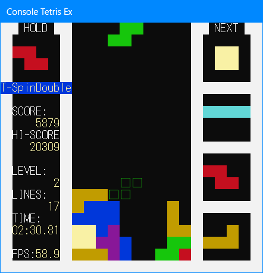

# ConsoleTetrisEx

This is a [Tetris](https://tetris.com/) game that runs at a command prompt (cmd.exe).

## Requirements
- Not run on safeboot
- File create, read and write permission
- Not running on virtual machine (without [Microsoft Hyper-V](https://learn.microsoft.com/windows-server/virtualization/hyper-v/hyper-v-overview?pivots=windows))

# Original credit

Thanks to [Ryoga-exe](https://github.com/Ryoga-exe) for allowing me to fork [Console-Tetris](https://github.com/Ryoga-exe/Console-Tetris/).
